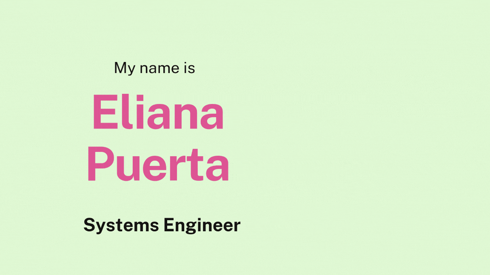

<h1 align="center"> Hello 👋🏻👩🏻‍💻 </h1> 

 
I'm passionate about software development from the city of Medellín, Colombia. I like creating web applications :smile:
 

## Frameworks and tools: :rocket:

## Find me: :speech_balloon::globe_with_meridians:

 

## GitHub Stats: :star::top:

